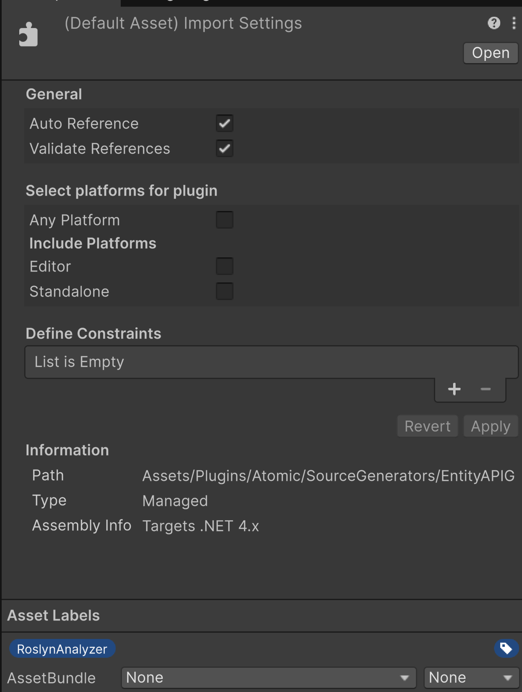

# ⚙️ Setup

This guide covers the full process of building the Atomic source generators, deploying them to a Unity project, and configuring Unity to load them as Roslyn analyzers.

The same steps apply to all four assemblies:

- `EntityAPIGenerator.dll`
- `EntityAPIAnalyzer.dll`
- `EventAPIGenerator.dll`
- `EventAPIAnalyzer.dll`

---

## 📑 Table of Contents

- [Prerequisites](#-prerequisites)
- [Build the Solution](#-build-the-solution)
- [Deploy to Unity](#-deploy-to-unity)
  - [Automatic Deployment](#automatic-deployment)
  - [Manual Copy](#manual-copy)
- [Configure Unity Import Settings](#-configure-unity-import-settings)
- [Verification](#-verification)
- [Troubleshooting](#-troubleshooting)

---

## 📝 Prerequisites

- **Unity 6** (6000.0 LTS or newer) with bundled Roslyn source-generator support
- **.NET SDK 8+** or **.NET 7+** to build the generators
- A Unity project that references the **Atomic.Entities** and/or **Atomic.Events** runtime assemblies
  - The `[GenerateEntityExtensionsAPI]` attribute is defined in the [Atomic.Entities](https://github.com/StarKRE22/Atomic/blob/main/Assets/Plugins/Atomic/Entities/Scripts/Codegen/GenerateEntityExtensionsAPIAttribute.cs) runtime assembly.
  - The `[GenerateEventExtensionsAPI]` attribute is defined in the [Atomic.Events](https://github.com/StarKRE22/Atomic/blob/main/Assets/Plugins/Atomic/Events/Scripts/CodeGen/GenerateEventExtensionsAPIAttribute.cs) runtime assembly.

---

## 📦 Build the Solution

Open a terminal in the `SourceGenerators` directory and run:

```bash
dotnet build Atomic.SourceGenerators.sln -c Release
```

Compiled assemblies are produced under each project's `bin/Release/netstandard2.0/` folder.

> 💡 **Tip:** Use `Release` configuration. The generators target `netstandard2.0` so Unity can load them as Roslyn analyzers.

---

## 🚀 Deploy to Unity

### Automatic Deployment

Provide the destination plugin folder when building:

```bash
dotnet build Atomic.SourceGenerators.sln -c Release \
  -p:AtomicDeployToUnity=true \
  -p:AtomicUnityPluginDir="C:\YourProject\Assets\Plugins\Atomic\SourceGenerators"
```

Only the `.dll` files are copied (PDBs are left behind).

### Manual Copy

If you prefer to copy manually, the target layout in your Unity project should be:

```
Assets/Plugins/Atomic/SourceGenerators/
├── EntityAPIGenerator.dll
├── EntityAPIAnalyzer.dll
├── EventAPIGenerator.dll
└── EventAPIAnalyzer.dll
```

---

## 🔧 Configure Unity Import Settings

For **each** of the four DLLs:

1. Select the DLL in the Unity **Project** window.
2. In the Inspector, add the **Asset Label**:

   ```
   RoslynAnalyzer
   ```

3. Under **Select platforms for plugin**, uncheck **Any Platform**.
4. Under **Include Platforms**, uncheck **Editor**, **Standalone**, and any other platforms.

The final settings should look like this:

- **Auto Reference**: ✅ checked
- **Validate References**: ✅ checked
- **Select platforms for plugin**
  - **Any Platform**: ⬜ unchecked
  - **Editor**: ⬜ unchecked
  - **Standalone**: ⬜ unchecked
  - All other platforms: ⬜ unchecked



> ⚠️ **Important:** Leaving all platforms unchecked is correct. The assemblies are analyzers, not runtime plugins.

After changing the settings, click **Apply** and rebuild the project (`Assets → Reimport All` or restart the editor).

---

## ✅ Verification

Create a test file in your Unity project and build:

```csharp
using Atomic.Entities;

[GenerateEntityExtensionsAPI]
public static partial class TestAPI
{
    public static readonly ValueKey<IEntity, int> Health = new(nameof(Health));
}
```

If the generators are loaded, you can use the generated extension method anywhere:

```csharp
IEntity entity = new Entity();
entity.AddHealth(100);
int health = entity.GetHealth();
```

For event generators, test with:

```csharp
using Atomic.Events;

[GenerateEventExtensionsAPI]
public static partial class TestEventAPI
{
    public static readonly EventKey<IEventBus> GameStarted = new(nameof(GameStarted));
}
```

```csharp
IEventBus bus = new EventBus();
bus.SubscribeGameStarted(() => Debug.Log("Started!"));
bus.InvokeGameStarted();
```

---

## 🔧 Troubleshooting

### Generated methods do not appear in IntelliSense

1. Confirm the DLLs are in `Assets/Plugins/Atomic/SourceGenerators/`.
2. Confirm each DLL has the **RoslynAnalyzer** asset label.
3. Confirm **Any Platform** is unchecked and all platforms are unchecked.
4. Restart Unity or run `Assets → Reimport All`.

### Build errors after adding the DLLs

- Make sure the DLLs are **not** included in any runtime platform.
- Make sure every `[GenerateEntityExtensionsAPI]` / `[GenerateEventExtensionsAPI]` field is initialized with a non-default constructor, e.g. `new(nameof(FieldName))`. The analyzers report missing or invalid initializers.

### Inspect generated source

The generators produce code **in-memory**. To write the generated files to disk, define the symbol:

```
ATOMIC_OUTPUT_SOURCEGEN_FILES
```

in `Edit → Project Settings → Player → Scripting Define Symbols`. Generated files are then written to:

```
Temp/GeneratedCode/
```

For more details, see the generator and analyzer guides:

- [Entity API Generator](EntityAPIGenerator.md)
- [Event API Generator](EventAPIGenerator.md)
- [Entity API Analyzer](EntityAPIAnalyzer.md)
- [Event API Analyzer](EventAPIAnalyzer.md)
